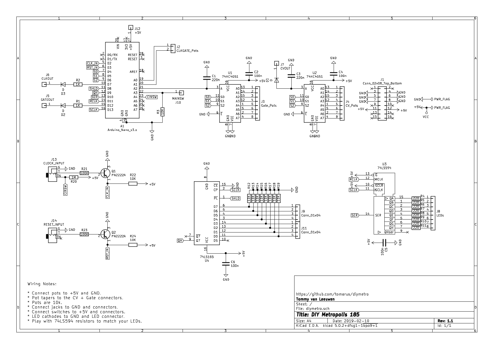

DIY Metro
=========

An Intellijel Metropolis / Roland System-100 model 185 / Detroit Underground DU-SEQ clone using an Arduino Nano.

This is highly experimental.

* **Don't use the kicad PCB, it's not working**

* [View schematic as pdf](assets/schematic.pdf)

